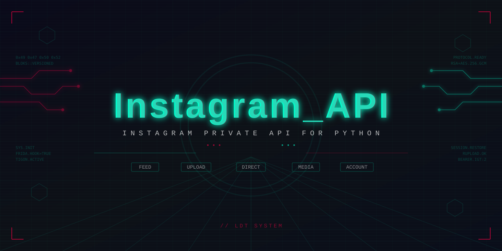

# Instagram Private API

<p align="center">
  
</p>

繁體中文 | **[English](README.md)**

從 Android app 封包逆向工程的 Instagram 私有 API Python 客戶端。

> **僅供教育與研究用途。** 與 Instagram 或 Meta 無關。

## 功能特色

- **70+ 個端點**，涵蓋 11 個模組 — 動態、用戶、媒體、上傳、私訊、探索等
- **25 個帶型別回應模型**，IDE 完整自動補全，使用屬性存取
- **自動 Session 管理** — 登入一次，Session 自動持久化
- **2FA 支援** — 登入時自動處理
- **上傳系統** — 圖片、影片、多圖輪播、限時動態（圖片及影片）
- **個人檔案編輯** — 名字、簡介、大頭貼
- **自動翻頁** — 粉絲/追蹤清單內部自動分頁

## 安裝

```bash
pip install requests pycryptodome Pillow
```

- Python >= 3.10
- `Pillow` 為選配（僅影片自動生成封面及 PNG 轉 JPEG 時需要）

## 快速開始

```python
from Instagram_API import InstagramAPI

api = InstagramAPI()
api.login("username", "password")  # 自動 session 復原、2FA 自動處理

# 用戶資訊
info = api.user_info(api.user_id)
print(info.user.username, info.user.follower_count)

# 動態時報
timeline = api.feed_timeline()
for item in timeline.feed_items:
    if item.media_or_ad:
        print(item.media_or_ad.user.username)
```

## 使用範例

### 媒體互動

```python
# 按讚 / 取消按讚 / 收藏
api.media_like(media_id)
api.media_unlike(media_id)
api.media_save(media_id)

# 留言
api.media_comment(media_id, "讚!")
comments = api.media_comments(media_id)
```

### 上傳 & 發佈

```python
# 單張圖片
api.publish_photo("photo.jpg", caption="Hello!")

# 影片（自動生成封面）
api.publish_video("video.mp4", caption="影片!", duration=10.0)

# 限時動態
api.publish_story_photo("story.jpg")
api.publish_story_video("story.mp4", duration_ms=15000)

# 多圖輪播
r1 = api.upload_photo(open("a.jpg", "rb").read())
r2 = api.upload_photo(open("b.jpg", "rb").read())
api.configure_sidecar([
    {"upload_id": r1.upload_id},
    {"upload_id": r2.upload_id}
], caption="輪播")

# 刪除 / 典藏
api.media_delete(media_id)
api.media_archive(media_id)
```

### 社交功能

```python
# 粉絲列表（自動翻頁）
fl = api.followers(user_id, count=200)
for u in fl.users:
    print(u.username)

# 追蹤 / 取消追蹤
api.friendship_create(user_id)
api.friendship_destroy(user_id)

# 用 user_id 直接私訊（不需要 thread_id）
api.direct_send_text("hello", recipient_users=[user_pk_id])

# 用對話串發送
api.direct_send_text("hello", thread_ids=[thread_id])
```

### 個人檔案編輯

```python
# 修改名字和簡介
api.edit_profile(full_name="新名字", biography="新簡介")
api.set_biography("快速更新簡介")

# 更換 / 移除大頭貼
api.change_profile_picture(open("pic.jpg", "rb").read())
api.remove_profile_picture()
```

### Session 管理

```python
# Session 登入後自動儲存
# 下次呼叫 login() 會自動復原，不需重新認證
api.login("username", "password")  # 有效 session 時瞬間完成

# 手動儲存
api.save_session()
```

Session 儲存在 `sessions/_username.json`。

## 端點

| 分類 | 主要方法 | 數量 |
|------|----------|------|
| 認證 | `login`, `two_factor_verify` | 6 |
| 用戶 | `user_info`, `user_info_by_username`, `user_search` | 6 |
| 動態 | `feed_timeline`, `user_feed`, `feed_reels_tray`, `user_story` | 6 |
| 媒體 | `media_info`, `media_like`, `media_save`, `media_comment`, `create_note` | 13 |
| 上傳 | `publish_photo`, `publish_video`, `publish_story_photo`, `configure_sidecar`, `media_delete` | 11+ |
| 私訊 | `direct_inbox`, `direct_send_text`, `direct_send_media_share` | 7 |
| 探索 | `discover_explore`, `clips_stream`, `discover_chaining` | 4 |
| 通知 | `news_inbox`, `notifications_badge`, `notification_settings` | 3 |
| 好友 | `friendship_show`, `friendship_create`, `followers`, `following` | 6 |
| 帳號 | `current_user`, `edit_profile`, `set_biography`, `change_profile_picture` | 16 |
| 直播 | `live_good_time` | 1 |

完整使用範例請參考 [`examples/`](examples/) 目錄。

## 專案結構

```
Instagram_API/
├── client.py          # API 客戶端 + session 管理
├── models.py          # 25 個型別回應模型
├── crypto.py          # 密碼加密（RSA + AES-256-GCM）
├── constants.py       # API 端點 & headers
├── device.py          # 裝置身份產生
├── bloks.py           # bloks 協議處理
└── endpoints/         # 11 個 mixin 模組
    ├── auth.py        # 登入、2FA、session
    ├── feed.py        # 動態時報、限時動態
    ├── users.py       # 用戶資訊、搜尋
    ├── media.py       # 按讚、收藏、留言、Notes
    ├── upload.py      # 圖片/影片上傳 & 發佈
    ├── direct.py      # 私訊收件匣 & 訊息
    ├── discover.py    # 探索、Reels
    ├── notifications.py
    ├── friendships.py # 追蹤、粉絲清單
    ├── account.py     # 個人檔案編輯、設定
    └── live.py

sessions/              # 自動管理的 session 檔案
examples/              # 各分類使用範例
```

## 問題回報

如果有任何問題或遇到困難，歡迎在 [Issues](https://github.com/ldtsystem2020/Instagram_API/issues) 上發問。

## 授權條款

本專案採用 MIT 授權條款 — 詳見 [LICENSE](LICENSE) 檔案。

Copyright (c) 2026 LDT System
